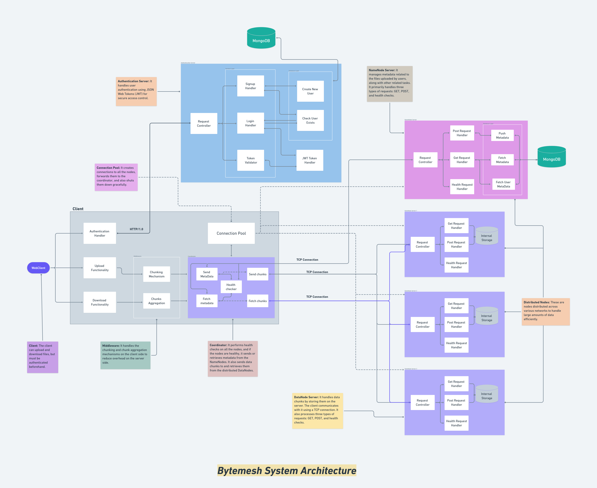

# 🚀 ByteMesh


<strong> Distributed File Storage (DFS) </strong> <br>
Fast. Reliable. Fault-tolerant. <br>
Stores huge files across multiple nodes — so your data is safe, accessible, and scales effortlessly.

<hr>

## 🧠 Architecture


<hr>

## 👀 Overview

**[▶️ Watch the project](https://youtu.be/LSwUGCxp6Bo)**


<hr>

## 📁 Project Structure

```bash
.
├── /cmd                    🧠 Entry point of the main DFS program
│   └── main.go

├── /client                 💻 Handles all client-side tasks (CLI)
│   ├── upload.go
│   ├── download.go
│   └── retrievefiles.go

├── /logger                 📝 Manages logging (errors, info)
│   └── logger.go

├── /middleware             📦 Implements file chunking mechanism
│   └── middleware.go

├── /coordinator            📡 Coordinates data distribution across nodes
│   └── coordinator.go

├── /models                 🧱 Defines core data structures
│   ├── chunk.go
│   ├── chunkdata.go
│   └── metadata.go

├── /scripts                ⚙️ Dev automation scripts
│   ├── start-nodes.sh
│   └── stop-nodes.sh

├── /utils                  🛠️ Helper utilities
│   ├── checkemptyfield.go
│   ├── connectionpool.go
│   ├── filename.go
│   └── removefile.go

├── /auth                   🔐 Authentication microservice
│   ├── /cmd                🧠 Server entry point
│   │   └── server.go
│   ├── /config             ⚙️ MongoDB & JWT configurations
│   │   ├── mongo.go
│   │   └── jwt.go
│   ├── /middleware         🌐 CORS handling
│   │   └── cors.go
│   ├── /model              🧱 User data model
│   │   └── user.go
│   ├── /repository         💾 MongoDB data access layer
│   │   └── userrepo.go
│   ├── /service            🧠 Business logic for auth
│   │   ├── login.go
│   │   ├── signup.go
│   │   └── validate.go
│   └── /utils              🛡️ Utility functions for auth
│       └── encryptpass.go

├── /namenode               🗂️ Namenode server for metadata management
│   ├── server.go
│   ├── /database           💾 DB configuration
│   │   └── mongo.go
│   ├── /health             🩺 Health check API
│   │   └── health.go
│   ├── /logger             📝 Logging utility
│   │   └── logger.go
│   ├── /model              📊 Metadata structure
│   │   └── metadata.go
│   └── /service            📡 Request handlers (GET, POST)
│       └── service.go

├── /datanodes              🧩 Distributed storage nodes (monolith structure)
│   ├── /server1
│   │   ├── server.go
│   │   ├── /logger
│   │   │   └── logger.go
│   │   └── health.go
│   ├── /server2            🧬 Follows same structure as server1
│   └── /server3            🧬 Follows same structure as server1

├── /webclient              🌐 Web-based client (UI)
│   ├── /src
│   │   ├── index.html         🏠 Home page
│   │   ├── auth.html          🔐 Signup/Login page
│   │   ├── dashboard.html     📂 File management interface
│   │   ├── /css               🎨 Stylesheets
│   │   └── /js                ⚙️ Scripts
│   └── /assets                🖼️ Images, fonts, icons

├── /gateway                🚪 API Gateway between WebClient & Datanodes
│   ├── server.go
│   ├── /controller          📥 Handles upload/download requests
│   │   └── controller.go
│   └── /middleware          🌐 CORS Middleware
│       └── cors.go

└── /testing                🧪 Automated UI testing framework
    └── /ui                 💻 Page Object Models, tests & utils for UI
        ├── /pages          📄 Individual page objects representing UI elements
        │   ├── about_page.py
        │   ├── auth_page.py
        │   ├── dashboard_page.py
        │   ├── index_page.py
        ├── /tests          ✔️ Test cases using page objects & utils
        │   ├── test_about.py
        │   ├── test_auth.py
        │   ├── test_dashboard.py
        │   ├── test_index.py
        │   ├── test_login.py
        │   ├── test_signup.py
        ├── /utils          🔧 Utility functions/helpers for tests
        │   └── utils.py
        └── conftest.py     🐍 Pytest fixtures & WebDriver configuration

```

## ⚙️ Setup

Getting started with **ByteMesh**, your distributed file storage system, is simple and smooth. Follow these steps to get up and running locally:

---

### ✅ Prerequisites

Make sure the following tools are installed:

| Tool       | Recommended Version | Description                        |
|------------|----------------------|------------------------------------|
| 🐹 Go       | `v1.23.4`             | Backend development (DFS core)     |
| 🌐 Node.js  | `v21.x`               | For web client and frontend tools  |
| 🍃 MongoDB  | `v6.x or above`       | Primary database                   |
| 🔐 JWT Lib  | latest                | For authentication (Go module)     |
| 📦 MongoDB Driver | latest          | Go driver for database connection  |

---

### 🚀 Clone the Repository

```bash
git clone https://github.com/AdityaByte/ByteMesh.git
cd ByteMesh
```

### 🔧 Configure Environment Variables

Create .env files in the respective microservices (auth/, namenode/, gateway/) with your environment-specific values.

```bash
# .env
MONGO_URI=mongodb://localhost:27017
DB_NAME=godb
COLLECTION=userdata
AUTH_SERVER_URL=http://localhost:8080
```

### 📦 Install Dependencies
#### 🔹 Go Modules
Navigate to each Go service folder and run:
```bash
go mod tidy
```

### 🛠️ Start the Services
You can run each service manually like this:
```bash
# Run Auth Service
cd auth/cmd
go run .

# Run Namenode
cd ../../namenode
go run .

# Run Datanodes (Example for Server 1)
cd ../datanodes/server1
go run .

# Run Gateway
cd ../../gateway
go run .

# Run Web Client (Optional)
cd ../webclient
node server.js
```
Or just use the 🧙‍♂️ auto-launch script below ⬇️
```bash
cd scripts
./start-nodes.sh # Run it in git bash
./stop-nodes.sh  # Run it in powershell or command line

```
client can lauch the auth server by its own too
```bash
# For development only
cd cmd
go run . auth start # To start the auth server
go run . auth stop # To stop the auth server
```

### ✅ Done!
You’re now all set to use ByteMesh – a fast, scalable and fault-tolerant distributed file system 💾⚡

## 🧪 How to Use

ByteMesh offers **two powerful interfaces**:<br>
🔹 A robust **CLI** for devs and power users <br>
🔹 A clean **Web Client** for easy interaction

---

### ⚙️ Using CLI

Navigate to the entry point:

```bash
cd cmd
```

#### 🔐 Start Authentication Server
```bash
go run . auth start
```
Starts the standalone authentication microservice powered by JWT + MongoDB.

#### 📝 Sign Up
```bash
go run . signup -username <your_username> -password <your_password>
```
Creates a new user and stores credentials securely.

#### 🔓 Login
```bash
go run . login -username <your_username> -password <your_password>
```
Generates a JWT token stored locally in:
```
~/.auth/token.jwt
```
Used automatically in future uploads/downloads.

#### 📤 Upload File
```bash
go run . -upload "/absolute/path/to/yourfile.pdf"
```
The file is chunked, encrypted (if enabled), and distributed across nodes with metadata sent to the namenode.

#### 📥 Download File
```bash
go run . -download "filename.extension"
```
Fetches file metadata, pulls chunks from distributed nodes, reassembles them locally.
<hr>

### 🌐 Using Web Client (GUI)
The user-friendly front-end interface is served at:
```bash
http://localhost:5500
```
(If you're using live-server or vite, the port may vary.)

#### ✨ Web Features

- 🔐 **JWT Auth** — Secure sign up & login
- 📂 **Upload** — Store files in distributed nodes
- 📄 **View Files** — Browse your uploaded content
- 📥 **Download** — Retrieve files anytime, anywhere
- 💡 **Responsive UI** — Sleek, intuitive & user-friendly

<hr>

## 🧰 Technologies Used

 
 
 
 
 
 
 
 

---

## 👨‍💻 Author

Built with ❤️ by **[@Aditya Pawar](https://github.com/AdityaByte)**

[](https://www.buymeacoffee.com/adityabyte)

